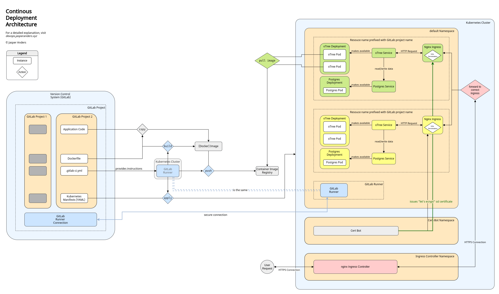

 _Open the diagram above in a separate tab and follow along._

# oForest Codeflow

In the next paragraphs, we follow a single line of code. From its creation to its deployment to the internet. You will find keywords highlighted the first time they appear. Clicking them will provide high level motivation, specific setup procedures, and in some cases an overview of useful commands.

Being checked into a [[01 Understanding DevOps#Version Control System|version control system]] (VCS) is the very first big step toward deployment for a code snippet. This example uses [[00 Understanding GitLab|GitLab]] as a VCS platform. The moment GitLab realizes there has been a new commit, it triggers a [[01 Understanding DevOps#CI Pipeline|pipeline]], more specifically the [[03 Setting Up a GitLab CI Pipeline|GitLab CI Pipeline]]. This pipeline needs physical computing resources to be run on. Luckily, the project administrator has provided shared [[01 Connecting a GitLab Runner|GitLab Runners]] beforehand. And just like that, the
runners start performing the steps defined in a special file, the `.gitlab-ci.yml`.

First thing the runners do is build an [[01 Containerization Terminology#Image|image]]. For this, they use [[00 Understanding Docker|Docker]]. The build process is specified in the [[01 Containerization Terminology#Dockerfile|Dockerfile]]. While building, the line of code that we follow gets copied over to the image, just like every other line of code. The finished build is then pushed to the [[01 Containerization Terminology#Container Registry|GitLab container registry]]. The next step in the CI pipeline is the actual deployment. This step has to wait for now. We first must discuss the structure of our production environment.

For the server our experiment will be deployed on, we use is an Ubuntu 20.04 LTS machine, provisioned by [[00 Provisoning a Server|bw Cloud]], a cloud provider for universities in the state of
Baden-Württemberg, Germany. Any cloud provider would work well. We want our applications to run in a [[00 Understanding Kubernetes|Kubernetes cluster]], we thus install a fully working Kubernetes version using [[02 MicroK8s Setup|MicroK8s]]. Additionally, we add an [[01 Kubernetes Components#Ingress|ingress controller]] and a [[03 SSL Encryption using Cert Manager|SSL certificate issuer]]. Lastly, we add the GitLab Runner, we introduced earlier, to the cluster. The runner now uses the cluster's resources to run our pipelines. It also has access to the [[04 Using Kubernetes#kubectl|kubectl]] command and thus can make changes to our
cluster. We use this to apply and delete [[01 Kubernetes Components#Manifests|Kubernetes manifests]].

As we now have laid out our production environment, we can take a closer look at the next step of our CI pipeline, the deployment. The runner applies the manifests we specified in our project repository. The cluster then immediately gets to work and tries to match the state described in these manifests. For this, it has to create multiple resources:

First, two [[01 Kubernetes Components#Deployment|deployments]] are created. Both start their respective [[01 Kubernetes Components#Pod|pods]]. The first Deployment is the oTree application. The second is a Postgres database, where all application data is stored. Both resources are started from container images. The Postgres resource is based on the official Postgres image found on the [docker hub](https://hub.docker.com/_/postgres), the other is pulled from the GitLab Registry. Remember that, our runners build and pushed a new image to this registry earlier.

To allow for communication between deployments and to the outside, one [[01 Kubernetes Components#Service|service]] each is created. After this, the oTree service is connected to the Postgres service, application data can now be stored and red. Until now, we wouldn't reach our service over the internet. To achieve this, we create an [[01 Kubernetes Components#Ingress|ingress]] resource. In the manifest for the ingress, we provide the URL, under which our application should be available. The ingress controller will now forward all incoming traffic to this new ingress resource. Because the [[03 SSL Encryption using Cert Manager|cert bot]] provides us with a valid SSL certificate, incoming traffic will arrive over HTTPS. The actual oTree Application does not support HTTPS traffic, thus we terminate the SSL at the Ingress and forward simple HTTP traffic to our application. On the way back, the HTTP traffic is encrypted again at the ingress, then forwarded to the ingress controller and finally back to the user.

Our line of code has made the journey. It is now deployed to a production environment. This concludes the architectural overview.

# And Now You!

[[03 Setup|Start your own oTree deployment.]]
