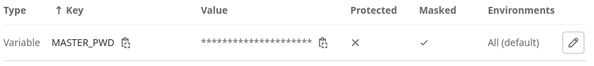

# Setup

## Creating a Continuous Deployment Environment

We have seen an overview of the architecture in the previous section. Now we
will show how to actually set up.

## Server Set Up

1. [[00 Provisoning a Server|Provision a Server]]
1. [[02 MicroK8s Setup|Install Kubernetes]]
1. [[03 SSL Encryption using Cert Manager|Install Cert Manager into your cluster]]

## GitLab Set Up

1. [[01 Connecting a GitLab Runner|Connect a GitLab Runner to your cluster.]]
1. [[02 GitLab Container Registry Integration|Connect allow Kubernetes pods to pull from the GitLab registry]]
1. [[03 Setting Up a GitLab CI Pipeline|Write and run a CI Pipeline]]

## Further Admin Setup

1. Add DNS resolution entries for experiments.
2. Do multiple test runs with backup experiments running.
3. Check out [[04 Further Considertaions| further considerations]].

## New Experiment Setup for Admin

1. Assign free Project URL to experiment.
2. Make sure no more experiments are running under this URL. You can use the
   [[03 Setting Up a GitLab CI Pipeline|DELETE button]] in the experiments CI
   pipeline.
3. Invite experimenter to GitLab Project. And tell them their URL.

## New Experiment Setup for Experimenter

This setup can be also found in the README of the oGardener in the oForest
project.

1. Clone the oGardener and create a new project in the oForest group. Add this
   new repo as origin. To do this, make sure you have Git installed and run:
   ```bash
   # rename folder for your project
   git mv oGardener YOUR_PROJECT_NAME
   # rename old origin to oGardener
   git remote rename origin oGardener
   # add your project url
   git remote add origin YOUR_PROJECT_URL
   ```
2. Move your experiment code to oTree folder. Also make sure to include all
   dependencies in your `requirements.txt` or `Pipenv & Pipenv.lock`. If you
   have missing dependencies, your project won't run.
3. Make sure to leave `.resetdb.sh` in the oTree folder untouched. It is a
   hidden file, if you don't see it, don't worry about it.
4. Change ingress URL according to your assigned project URL. For this, add an
   environment variable to your GitLab project. Name it EXPERIMENT_URL it should
   look something like this: `experiment01.k2lab.iism.kit.edu`
5. Add MASTER_PWD as a CI/CD variable and choose a good password. It should be
   masked and not protected.
   
6. If necessary, adjust the Python version in the `Dockerfile` to match the
   oTree version you're using.
7. Stage, commit and push your changes. Make sure you push to `origin` not to
   `oGardener`. You can watch the pipeline running in GitLab, wait for it to be
   finished.
8. Now manually deploy to Production. Here you can also reset your database or
   delete the whole deployment.
