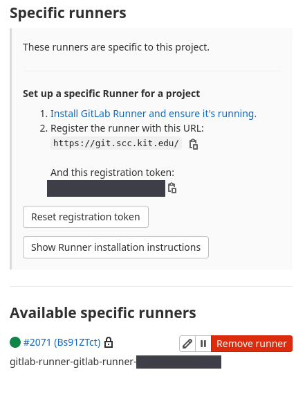

# Connecting a GitLab Runner to your cluster

GitLab allows us to run CI/CD pipelines. For this, GitLab provides _GitLab
Runners_. These runners can run on almost anywhere. If you use the official
[GitLab](https://gitlab.com) instance, for example, you can use _shared_ runners
provided by GitLab for all its users. But you could also run the GitLab runners
on your local machine.

We require our runners to run `kubectl` commands. This allows us to create,
apply and delete Kubernetes resources from the CI/CD pipeline. To achieve this,
we need the runners to be running inside our cluster.

First, we need to create a configuration file `gitlab-runner-config.yaml`

The values for this can be found under the repo settings > CI/CD > Runners. I
created a group for all the applications I want to deploy to live in. If you do
the same, I would suggest, to use the runner parameters of the group repository
(not of one specific application). In this way, the runner is shared throughout
the whole group.



```YAML
# gitlab-runner-config.yaml

gitlabUrl: https://gitlab.com/
runnerRegistrationToken: "YOUR_RUNNERTOKEN_HERE"
runners:
 # runner configuration, where the multi line strings is evaluated as
 # template so you can specify helm values inside of it.
 #
 # tpl: https://helm.sh/docs/howto/charts_tips_and_tricks/#using-the-tpl-function
 # runner configuration: https://docs.gitlab.com/runner/configuration/advanced-configuration.html
 config: |
   [[runners]]
     [runners.kubernetes]
       namespace = "{{.Release.Namespace}}"
       image = "ubuntu:16.04"
# this is required for docker in docker (dind) to run. We need this for our CI/CD to build containers.
       privileged = true
```

Now we can install the GitLab runner using `helm3`. Make sure the `helm3` add-on
is enabled.

```bash
microk8s helm3 install --namespace default gitlab-runner -f gitlab-runner-config.yaml gitlab/gitlab-runner
```

Uninstall GitLab runenr:

```bash
m helm3 delete --namespace default gitlab-runner
```

Make sure group runners are enabled.

# Read Next

[[GitLab CI-CD Pipeline]]
