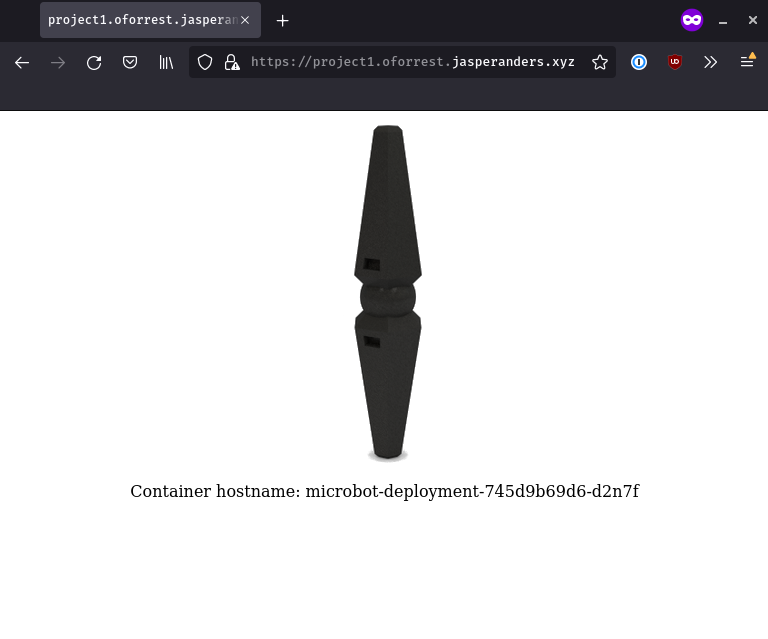

# Enable HTTPS with Cert Bot

In this section, we want to enable HTTPS traffic to our cluster. For this we need a certificate issuer, that is [Let's Encrypt](https://letsencrypt.org/), and we then specify an ingress resource to terminate our SSL connection.

**Important:** The standard port for HTTPS traffic is 443. So make sure port 443 is open, both on your firewall and that your cloud provider does not block traffic to this port. Otherwise, you won't be able to reach your application at all.

With this out of the way, let's get started:

1. Install Cert Manager into the Cluster

   ```bash
   kubectl apply -f https://github.com/jetstack/cert-manager/releases/download/v1.6.1/cert-manager.yaml
   ```

   Verify that everything is installed correctly. Notice that the cert manager
   resources get installed into the `cert-manager` namespace.

   ```bash
   kubectl get deployments -n cert-manager

   [Output]
   NAME                      READY   UP-TO-DATE   AVAILABLE   AGE
   cert-manager-cainjector   1/1     1            1           2m41s
   cert-manager              1/1     1            1           2m41s
   cert-manager-webhook      1/1     1            1           2m41s
   ```

2. Create the Certificate Issuer. We will use
   [Let's Encrypt](https://letsencrypt.org/de/) as a free issuer. Let's Encrypt
   offers a staging service, which has no quota limitation (because it issues no
   real certs). We can use this for testing and later switch to the production
   issuer to get a valid certificate for our services.

   First create the staging issuer.

   ```YAML
   # staging-issuer.yaml

   apiVersion: cert-manager.io/v1
   kind: Issuer
   metadata:
     name: letsencrypt-staging
   spec:
     acme:
       # The ACME server URL
       server: https://acme-staging-v02.api.letsencrypt.org/directory
       # Email address used for ACME registration
       email: user@example.com
       # Name of a secret used to store the ACME account private key
       privateKeySecretRef:
         name: letsencrypt-staging
       # Enable the HTTP-01 challenge provider
       solvers:
       - http01:
           ingress:
             class:  nginx
   ```

   Then create the production issuer.

   ```YAML
   # prod-issuer.yaml

   apiVersion: cert-manager.io/v1
   kind: Issuer
   metadata:
     name: letsencrypt-prod
   spec:
     acme:
       # The ACME server URL
       server: https://acme-v02.api.letsencrypt.org/directory
       # Email address used for ACME registration
       email: jasper.anders@online.de
       # Name of a secret used to store the ACME account private key
       privateKeySecretRef:
         name: letsencrypt-prod
       # Enable the HTTP-01 challenge provider
       solvers:
       - http01:
           ingress:
             class: public
   ```

   Apply both.

   ```bash
   kubectl apply -f staging-issuer.yaml
   kubectl apply -f prod-issuer.yaml
   ```

3. After we have created the certification issuer resource, we need to apply
   some changes to our ingress resource

   ```YAML
   # microbot-ingress.yaml

   apiVersion: networking.k8s.io/v1
   kind: Ingress
   metadata:
     name: microbot-ingress
     annotations:
       cert-manager.io/issuer: "letsencrypt-staging" # change this to "letsencrypt-prod" for a valid encryption
   spec:
     ingressClassName: public
     tls:
       - hosts:
           - project1.oforest.jasperanders.xyz
         secretName: quickstart-tls
     rules:
       - host: project1.oforest.jasperanders.xyz
         http:
           paths:
             - path: /
               pathType: Prefix
               backend:
                 service:
                   name: microbot-service
                   port:
                     number: 80
   ```

   ```
   kubectl apply -f microbot-ingress.yaml
   ```

   After applying this, we find our site to be SSL encrypted. You might, see a
   warning, just continue, and you will see your microbot. Note the little
   exclamation mark, this is because we used the staging issuer (this is also
   the reason you saw the warning).

   

   For production, we want to change the annotation in our manifest YAML from
   `cert-manager.io/issuer: "letsencrypt-staging"` to
   `cert-manager.io/issuer: "letsencrypt-prod"`. Also, you need to delete the SSL
   secret, the cert manager will recreate it with the production issuer.

   That's it. You enabled SSL encryption for your ingress resource.

# Read Next

This concludes the set-up process of the server.
[[01 Connecting a GitLab Runner|Next we will connect a GitLab runner to our cluster.]]

---

Sources: https://cert-manager.io/docs/tutorials/acme/ingress/