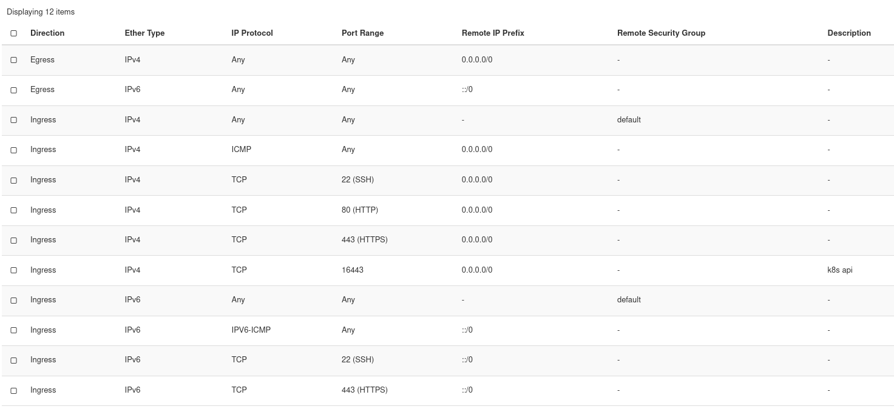

# Provisoning a Server

For the oForrest project, we use cloud resources from the [BW-Cloud](https://www.bw-cloud.org/). For students, there is only a rather low resource quota by default. The documentation of Kubernetes recommended at least 4 GB of memory. To request more quota, follow the instructions [here](https://www.bw-cloud.org/de/faq/quota).

We deployed a `m1.large` Ubuntu 20.04 LTS instance. Make sure you add `ssh` access to your machine.  Also check that your system is up-to-date. For this run:

```
sudo apt update
sudo apt upgrade
``` 

# Opening Ports

For any traffic to get through to your cluster or application that is deployed on your compute instance you need to open Ports. The standard ports are:

| For                                      | Port  |
| ---------------------------------------- | -----:|
| HTTP                                     | 80    |
| HTTPS                                    | 443   |
| SSH                                      | 22    |

Also, you should allow all egress traffic to exit, if you want to access the internet (you always want). Configure the default security policy as shown below. I tried to add another policy to keep the default one untouched, but at the time of this writing, this didn't seem to work. Instead, I adjusted the default security policy as shown below.



# Read Next

[[MicroK8s Setup|How to set up a Kubernetes cluster using microk8s.]]